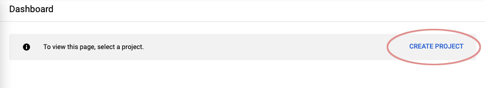
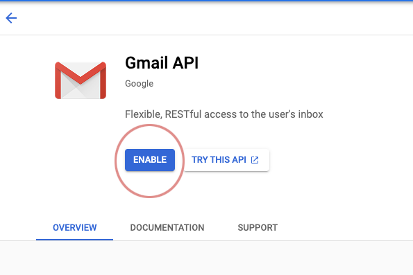
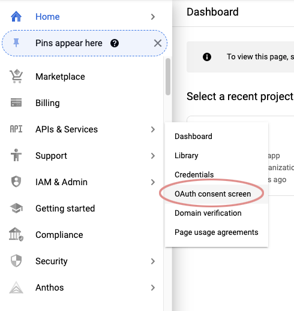
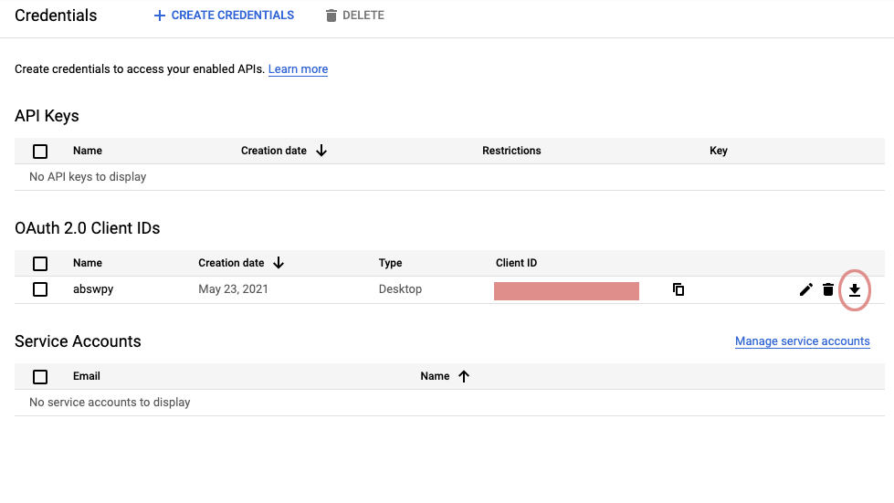

# Python Weather Email Client 🌤

## **5 day forecast sent to your email everyday**

_By Andrew Dotterer_ 🌈

**Table of Contents**

- [Requirements](#requirements)
- [Getting Set Up](#getting-set-up)
  - [Setup Gmail API](#setup-gmail-api)
- [Technology Used](#technology-used)
- [Updates](#updates)

# Requirements

- Python 3.0+
- Google Account
- Cron via Linux (Ubunutu) or macOS

# Getting Set Up

1. Clone this repository

```bash
   git clone https://github.com/adotterer/weather_sender_py.git
```

2. Install dependencies

```bash
   pipenv install -r requirements.txt
```

3. Get credentials and token from Gmail API:

   ### Setup Gmail API

   **\*\* Do not use Google's Gmail Python Quickstart guide**

   1. Go to [Google Cloud Dashboard](https://console.cloud.google.com/)

   2. Activate free trial or set up your account

   

   3. Click "Create Project" and follow the prompts

   

   4. Now that you've created a project, using the search bar, find for the Gmail API. Select. Then click "Enable".

   

   5. Select 'OAuth consent screen' under 'API & Services' in the sidebar. Choose the 'Desktop' application type.

   

   6. Select "Create Credentials". Select External or Internal(Internal is probably disabled)

   7. Select "Create" --> fill out the form.

   8. "Save and Continue"

   9. Go to the Credentials tab, under 'OAuth 2.0 Client IDs', download the credentials JSON file.

   

   10. Move the JSON file to the main directory of this project (same directory as this readme.md) AND:

       **---> IMPORTANT**: rename the JSON file to 'credentials.json'

4. Launch virtual enviornment

```bash
   pipenv shell
```

5. Set up Crontab

Change paths as needed:

```bash
0 8 * * * cd /Path/To/This/Project/ && /usr/local/bin/pipenv run python weather_sender.py
```

# Technology Used

# Updates

```

```
